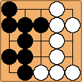
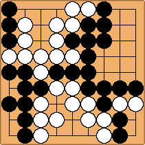

# Go Automatic Tallier (GoAT)
Automatically tally score for Go boards from an image.



---

## Table of Contents
* [Getting Started](#getting-started)
    * [Conda](#conda)
    * [Docker](#docker)
* [Usage](#usage)
* [Scoring](#scoring)
* [Imaging](#imaging)

---

## Getting Started
```shell
git clone -b main git@github.com:koisland/GoAT.git
cd GoAT
```

### Conda
```shell
conda create --name GoAT python=3.10
conda activate GoAT
pip install -r requirements.txt
```

### Docker
```shell
WIP
```

---

## Usage
Currently, usage is limited to the command-line with `main.py` as the entrypoint.

By default, black is marked as `1.0` and white is `0.0`.
```shell
usage: main.py [-h] -i INPUT -s SCORING [-k] [-cb CAP_BLK] [-cw CAP_WHT]

Calculate score from a Go board image.

options:
  -h, --help            show this help message and exit
  -i INPUT, --input INPUT
                        Input image.
  -s SCORING, --scoring SCORING
                        Scoring method.
  -k, --komi            Apply komi.
  -cb CAP_BLK, --cap_blk CAP_BLK
                        Captured black stones by white.
  -cw CAP_WHT, --cap_wht CAP_WHT
                        Captured white stones by black.
```

For example, this command reads `docs/images/9_9.png`, a digital image of a board and scores it using `Chinese` scoring with `komi` applied to White.



```shell
python main.py -i docs/images/9_9.png -s Chinese -k
```
```shell
{'Black': 44, 'White': 44.5}
```
---

## Scoring
Both `Chinese` and `Japanese` scoring methods are available with komi as a toggle-able option.

By default, komi is set to `7.5` for Chinese scoring and `6.5` for Japanese scoring.

Japanese scoring is a WIP.
* Currently can handle scenarios without seki.

## Imaging
Accomplished through use of packages:
* `opencv-python`
* `numpy`
* `statistics`.

General workflow is as follows:
1. Gaussian Blur ->
2. Global Threshold (Two for each piece type)->
3. Distance Transform (Only black) ->
4. Contour Detection ->
5. Cluster Pixels ->
6. Map Pixels to Dimensions ->
7. Generate Board

Several assumptions are made about the `--input` image.
* The image that only encompasses the digital board
  * A real-world image would require manually trimming such that the image only contains the board.
  * Lighting conditions are another issue that could be handled with localized histogram equalization with cv2's `clahe`.
