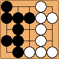
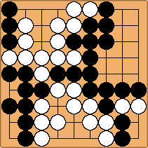

# Go Automatic Tallier (GoAT)
Automatically tally score for Go boards from an image. 

Currently, only digital boards work (See below). A real-world image classifier is a WIP. Both version use `opencv-python` to parse the board from an image and `numpy` for scoring.



---

## Table of Contents
* [Getting Started](#getting-started)
    * [Conda](#conda)
    * [Docker](#docker)
* [Usage](#usage)
* [Scoring](#scoring)
* [Imaging](#imaging)

---

## Getting Started
```shell
git clone -b main git@github.com:koisland/GoAT.git
cd GoAT
```

### Conda
```shell
conda env create --file env/environment.yaml
conda deactivate && conda activate GoAT
```

### Docker
```shell
```

---

## Usage
Currently, usage is limited to the command-line with `main.py` as the entrypoint.

By default, black is marked as `1.0` and white is `0.0`.
```shell
usage: main.py [-h] -i INPUT -s SCORING [-k]

Calculate score from a Go board image.

options:
  -h, --help            show this help message and exit
  -i INPUT, --input INPUT
                        Input image.
  -s SCORING, --scoring SCORING
                        Scoring method.
  -k, --komi            Apply komi.
```

For example, this command reads `images/9_9.png`, a digital image of a board and scores it using `Chinese` scoring with `komi` applied to White.



```shell
python main.py -i images/9_9.png -s Chinese -k 
```
```shell
{'Black': 44, 'White': 44.5}
```
---

## Scoring 
Both `Chinese` and `Japanese` scoring methods are available with komi as a toggle-able option.

By default, komi is set to `7.5` for Chinese scoring and `6.5` for Japanese scoring.

Japanese scoring is a WIP.

## Imaging
